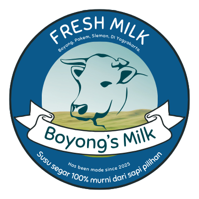
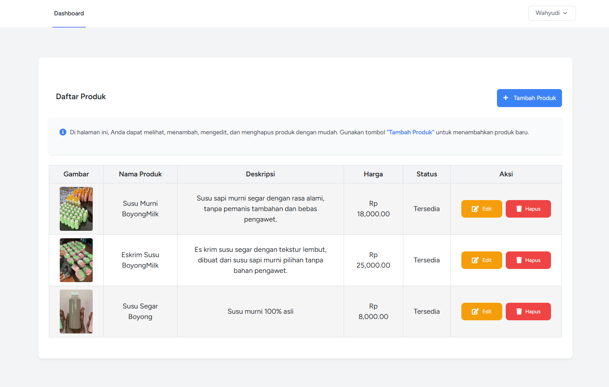

<div align="center">

<!-- Logo -->
<p align="center">
  
</p>

<!-- Title -->
<h1 style="font-size: 2em; margin: 20px 0 10px 0; font-weight: bold;">
  Boyong Milk
</h1>

<!-- Subtitle -->
<p style="font-size: 1.2em; color: #dadadaff; margin: 0 0 30px 0; font-weight: 500;">
  <em>Sistem Informasi Produk Susu Padukuhan Boyong</em>
</p>

[](https://laravel.com)
[](https://php.net)
[](https://tailwindcss.com)
[](https://getbootstrap.com)
[](https://www.mysql.com)

**Platform web modern untuk mengelola dan menampilkan produk susu dari Padukuhan Boyong dengan antarmuka yang elegan dan responsif.**

[⚡ Quick Start](QUICKSTART.md) • [🤝 Kontribusi](https://github.com/Aldayanday1/boyong_milk/pulls) • [📧 Support](https://github.com/Aldayanday1/boyong_milk/issues)

</div>

---

## 📖 Tentang Proyek

**Boyong Milk** adalah sistem informasi berbasis web yang dirancang khusus untuk mengelola dan mempromosikan produk-produk susu berkualitas dari Padukuhan Boyong. Proyek ini menggabungkan teknologi web modern dengan desain yang memukau untuk memberikan pengalaman pengguna yang optimal.

### 🎯 Tujuan Proyek

- 🌐 **Digitalisasi Bisnis**: Membawa produk lokal ke era digital
- 📱 **Aksesibilitas**: Memudahkan pelanggan mengakses informasi produk kapan saja
- 🎨 **Branding**: Meningkatkan citra profesional produk lokal
- 📊 **Manajemen**: Sistem pengelolaan produk yang efisien untuk admin

### 💡 Mengapa Boyong Milk?

- ✅ **Modern & Responsive** - Tampilan menarik di semua perangkat
- ✅ **User-Friendly** - Navigasi intuitif dan mudah digunakan
- ✅ **Fast & Secure** - Performa optimal dengan keamanan terjaga
- ✅ **Easy Management** - Dashboard admin yang sederhana namun powerful

---

## ✨ Fitur Utama

### 🎨 Landing Page Interaktif

<p align="center">
  
</p>

- **Hero Section** dengan parallax effect dan animasi smooth
- **Profile Section** menampilkan informasi Padukuhan Boyong
- **Video Gallery** untuk proses pengolahan susu
- **Image Carousel** dengan animasi scroll otomatis
- **Responsive Design** - Sempurna di desktop, tablet, dan mobile

### 🔐 Dashboard Admin

<p align="center">
  
</p>

**Fitur CRUD Lengkap:**
- ➕ **Create** - Tambah produk baru dengan form validation
- 📝 **Read** - Lihat semua produk dalam tabel interaktif
- ✏️ **Update** - Edit informasi produk dengan mudah
- 🗑️ **Delete** - Hapus produk dengan konfirmasi keamanan

**Informasi Produk yang Dikelola:**
- Nama Produk
- Kategori (Susu, Es Krim, Yogurt, dll)
- Harga & Berat
- Stok Tersedia
- Status Ketersediaan
- Tanggal Produksi & Kadaluarsa
- Deskripsi Lengkap
- Upload Gambar Produk

### 🎭 Animasi & Interaksi

- ⚡ **Fade-in animations** saat scroll
- 🌊 **Smooth transitions** antar section
- 🖱️ **Hover effects** pada card dan button
- 📜 **Parallax scrolling** di background
- 🔄 **Auto-scroll gallery** untuk galeri gambar

---

## 🛠️ Teknologi yang Digunakan

### Backend
- **Laravel 11.x** - PHP Framework modern dan powerful
- **PHP 8.2+** - Bahasa pemrograman server-side
- **MySQL** - Database management system yang robust
- **Laravel Breeze** - Authentication scaffolding
- **Eloquent ORM** - Database query builder

### Frontend
- **Tailwind CSS** - Utility-first CSS framework
- **Bootstrap 5.3** - UI component library
- **JavaScript (ES6+)** - Interaksi dinamis
- **Font Awesome** - Icon library
- **Google Fonts (Poppins)** - Typography

### Development Tools
- **Vite** - Modern frontend build tool
- **Composer** - PHP dependency manager
- **NPM** - Node package manager
- **Laravel Pint** - Code style fixer
- **Pest PHP** - Testing framework

---

## 📋 Prasyarat

Sebelum memulai instalasi, pastikan sistem Anda memiliki:

```
✓ PHP >= 8.2
✓ Composer
✓ Node.js & NPM
✓ Git
✓ MySQL >= 5.7 atau MariaDB >= 10.3
✓ Web Server (Apache/Nginx) atau Laravel Valet/Laragon
```

---

## 🚀 Instalasi

### 1️⃣ Clone Repository

```bash
git clone https://github.com/Aldayanday1/boyong_milk.git
cd boyong_milk
```

### 2️⃣ Install Dependencies

```bash
# Install PHP dependencies
composer install

# Install Node dependencies
npm install
```

### 3️⃣ Konfigurasi Environment

```bash
# Copy file environment
cp .env.example .env

# Generate application key
php artisan key:generate

# Edit file .env dan sesuaikan konfigurasi:
# - Database credentials
```

### 4️⃣ Setup Database

```bash
# Buat database MySQL
mysql -u root -p -e "CREATE DATABASE boyong_milk;"

# Update konfigurasi database di file .env:
DB_CONNECTION=mysql
DB_HOST=127.0.0.1
DB_PORT=3306
DB_DATABASE=boyong_milk
DB_USERNAME=root
DB_PASSWORD=your_secure_password

# Jalankan migrations
php artisan migrate
```

### 5️⃣ Setup Admin Credentials 🔒

**PENTING:** Tambahkan kredensial admin di file `.env` Anda:

```env
# Admin Credentials
ADMIN1_NAME="Your Admin Name"
ADMIN1_USERNAME=your_username
ADMIN1_EMAIL=admin1@boyongmilk.com
ADMIN1_PASSWORD=your_secure_password

ADMIN2_NAME="Second Admin"
ADMIN2_USERNAME=admin2_username
ADMIN2_EMAIL=admin2@boyongmilk.com
ADMIN2_PASSWORD=another_secure_password
```

Kemudian jalankan seeder:

```bash
# Seed admin users dan data awal
php artisan db:seed
```

### 6️⃣ Storage Link

```bash
# Buat symbolic link untuk storage
php artisan storage:link
```

### 7️⃣ Build Assets

```bash
# Development
npm run dev

# Production
npm run build
```

### 8️⃣ Jalankan Aplikasi

```bash
# Jalankan server development
php artisan serve

# Aplikasi akan berjalan di http://localhost:8000
```

---

## 🗂️ Struktur Proyek

```
boyong_milk/
├── 📁 app/
│   ├── Http/
│   │   ├── Controllers/
│   │   │   ├── ProdukController.php    # Controller untuk produk
│   │   │   └── ProfileController.php    # Controller untuk profile
│   │   └── Requests/
│   ├── Models/
│   │   ├── Produk.php                   # Model Produk
│   │   └── User.php                     # Model User
│   └── Providers/
├── 📁 database/
│   ├── migrations/                       # Database migrations
│   │   ├── create_produks_table.php
│   │   ├── create_users_table.php
│   │   └── ...
│   ├── seeders/                          # Data seeders
│   │   ├── AdminSeeder.php
│   │   └── ProdukSeeder.php
├── 📁 public/
│   ├── css/
│   │   ├── landingpage.css              # Style untuk landing page
│   │   ├── login_page.css               # Style untuk login
│   │   └── admin/                        # Style untuk admin
│   ├── images/                           # Asset gambar
│   └── js/
│       └── landingpage.js               # JavaScript landing page
├── 📁 resources/
│   ├── css/
│   │   └── app.css                      # Tailwind CSS
│   ├── js/
│   │   └── app.js                       # JavaScript utama
│   └── views/
│       ├── landingpage.blade.php        # View landing page
│       ├── dashboard.blade.php          # View dashboard
│       ├── auth/                         # Views authentication
│       └── produk/                       # Views produk CRUD
├── 📁 routes/
│   ├── web.php                          # Web routes
│   └── auth.php                         # Auth routes
├── 📄 composer.json                     # PHP dependencies
├── 📄 package.json                      # Node dependencies
├── 📄 tailwind.config.js                # Tailwind configuration
├── 📄 vite.config.js                    # Vite configuration
└── 📄 .env.example                      # Environment example
```

---

## 🎮 Cara Penggunaan

### 👤 Untuk Pengunjung (User)

1. **Akses Landing Page**
   - Buka `http://localhost:8000`
   - Scroll untuk melihat profil dan produk
   
2. **Lihat Produk**
   - Klik pada card produk untuk melihat detail
   - Informasi lengkap akan ditampilkan dalam modal

3. **Navigasi**
   - Gunakan navbar untuk berpindah section
   - Menu responsif untuk mobile device

### 🔐 Untuk Admin

1. **Login ke Dashboard**
   ```
   URL: http://localhost:8000/login
   
   Credentials: 
   Gunakan username dan password yang Anda set di file .env
   (Lihat bagian ADMIN1_USERNAME dan ADMIN1_PASSWORD)
   ```

2. **Kelola Produk**
   - **Tambah Produk**: Klik tombol "Tambah Produk"
   - **Edit Produk**: Klik tombol "Edit" pada produk
   - **Hapus Produk**: Klik tombol "Hapus" dengan konfirmasi
   
3. **Upload Gambar**
   - Pilih file gambar (JPG, PNG, JPEG)
   - Preview otomatis sebelum upload
   - Gambar disimpan di `storage/app/public/produk`

---

## 🔧 Konfigurasi

### Database

Edit file `.env` untuk konfigurasi database:

```env
DB_CONNECTION=mysql
DB_HOST=127.0.0.1
DB_PORT=3306
DB_DATABASE=boyong_milk
DB_USERNAME=root
DB_PASSWORD=your_password
```

**Catatan untuk Laragon:**
- Username default: `root`
- Password default: (kosongkan atau sesuai pengaturan Anda)
- Database akan otomatis dibuat jika menggunakan Laragon

### Storage

Pastikan folder `storage` dan `bootstrap/cache` memiliki permission write:

```bash
chmod -R 775 storage bootstrap/cache
```

### Mail (Opsional)

Untuk fitur email (reset password, dll):

```env
MAIL_MAILER=smtp
MAIL_HOST=smtp.gmail.com
MAIL_PORT=587
MAIL_USERNAME=your-email@gmail.com
MAIL_PASSWORD=your-app-password
```

---

## 🧪 Testing

Jalankan test suite menggunakan Pest PHP:

```bash
# Jalankan semua test
php artisan test

# Jalankan test spesifik
php artisan test --filter=ProdukTest

# Test dengan coverage
php artisan test --coverage
```

---

## 📊 Database Schema

### Tabel: produks

| Column | Type | Description |
|--------|------|-------------|
| id | BIGINT | Primary key |
| nama_produk | VARCHAR(255) | Nama produk |
| harga | DECIMAL(10,2) | Harga produk |
| kategori | ENUM | Kategori produk |
| status | ENUM | Status ketersediaan |
| stok | INTEGER | Jumlah stok |
| berat | VARCHAR(50) | Berat produk |
| tanggal_produksi | DATE | Tanggal produksi |
| tanggal_kadaluarsa | DATE | Tanggal kadaluarsa |
| gambar | VARCHAR(255) | Path gambar |
| deskripsi | TEXT | Deskripsi produk |
| created_at | TIMESTAMP | Waktu dibuat |
| updated_at | TIMESTAMP | Waktu diupdate |

---

## 🎨 Customization

### Mengubah Warna Theme

Edit file `tailwind.config.js`:

```javascript
module.exports = {
  theme: {
    extend: {
      colors: {
        primary: '#your-color',
        secondary: '#your-color',
      }
    }
  }
}
```

### Mengubah Font

Edit file `public/css/landingpage.css`:

```css
@import url('https://fonts.googleapis.com/css2?family=YourFont&display=swap');

* {
  font-family: 'YourFont', sans-serif;
}
```

---

## 💡 Troubleshooting

<details>
<summary><b>Error: "Class 'PDO' not found"</b></summary>

Aktifkan extension MySQL di `php.ini`:
```ini
extension=pdo_mysql
extension=mysqli
```
</details>

<details>
<summary><b>Error: "SQLSTATE[HY000] [1045] Access denied"</b></summary>

Periksa konfigurasi database di `.env`:
- Pastikan username dan password benar
- Pastikan MySQL service sudah berjalan
- Untuk Laragon: buka Menu > MySQL > Start
</details>

<details>
<summary><b>Error: "SQLSTATE[HY000] [1049] Unknown database"</b></summary>

Buat database terlebih dahulu:
```bash
mysql -u root -p -e "CREATE DATABASE boyong_milk;"
```
</details>

<details>
<summary><b>Error: "Permission denied" saat upload gambar</b></summary>

Berikan permission pada folder storage:
```bash
chmod -R 775 storage
php artisan storage:link
```
</details>

<details>
<summary><b>Styling tidak muncul</b></summary>

Build ulang assets:
```bash
npm run build
php artisan optimize:clear
```
</details>

<details>
<summary><b>Database migration error</b></summary>

Reset database:
```bash
php artisan migrate:fresh --seed
```
</details>

---

## 🤝 Kontribusi

Kontribusi sangat diterima! Berikut cara berkontribusi:

1. Fork repository ini
2. Buat branch fitur (`git checkout -b feature/AmazingFeature`)
3. Commit perubahan (`git commit -m 'Add some AmazingFeature'`)
4. Push ke branch (`git push origin feature/AmazingFeature`)
5. Buat Pull Request

---


## 📜 Lisensi

Project ini dilisensikan di bawah [MIT License](LICENSE).

---

## 👨‍💻 Developer

<div align="center">

**Dikembangkan dengan ❤️ untuk Padukuhan Boyong**

Jika Anda memiliki pertanyaan atau saran, jangan ragu untuk menghubungi:

📧 Email: onlymarfa69@gmail.com

---

### ⭐ Jika proyek ini bermanfaat, berikan Star!

**Made with Laravel 11 | Tailwind CSS | Bootstrap 5**

</div>
