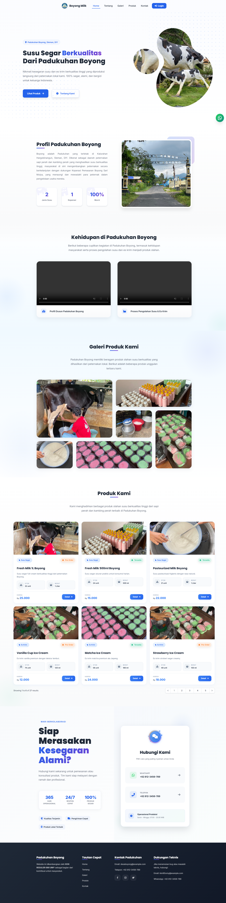
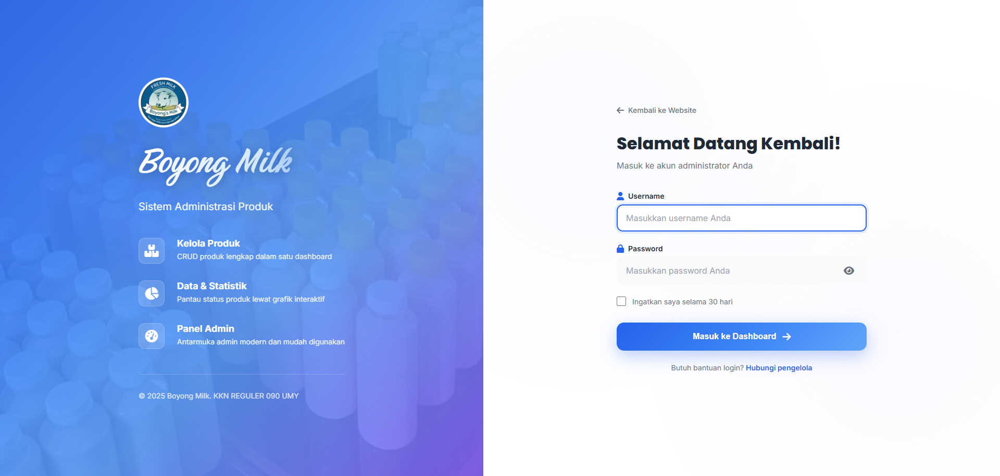
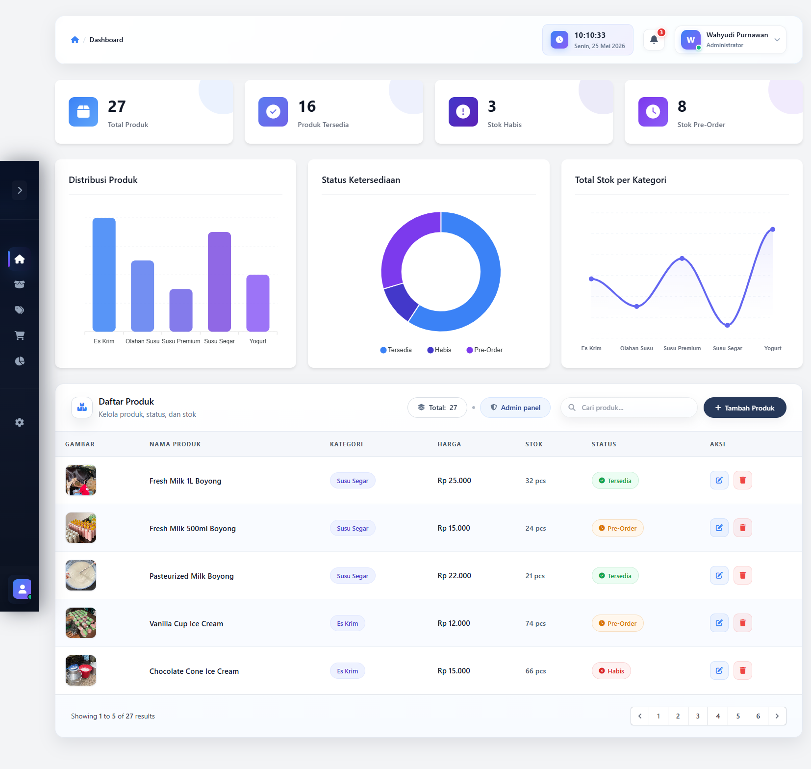

# Boyong Milk

Product showcase platform for dairy-based products with an internal dashboard handling inventory, product, and analytics management.





## Overview

Boyong Milk is a Laravel-based commerce platform designed to manage and showcase dairy products through a public-facing website and an operational admin dashboard. The system focuses on structured product management, inventory tracking, analytics visualization, and clean UI/UX consistency.

## Features

* Public product showcase
* Product detail modal
* Inventory & stock management
* Analytics dashboard
* Category-based product organization
* Product search & pagination

## Tech Stack

* Laravel 11
* Blade
* MySQL
* Tailwind CSS
* JavaScript
* Vite

## Installation

```bash
git clone https://github.com/your-username/boyong_milk.git

cd boyong-milk

composer install

npm install

cp .env.example .env

php artisan key:generate

php artisan migrate --seed

npm run dev

php artisan serve
```

## Status

Completed and maintained as a portfolio project.
